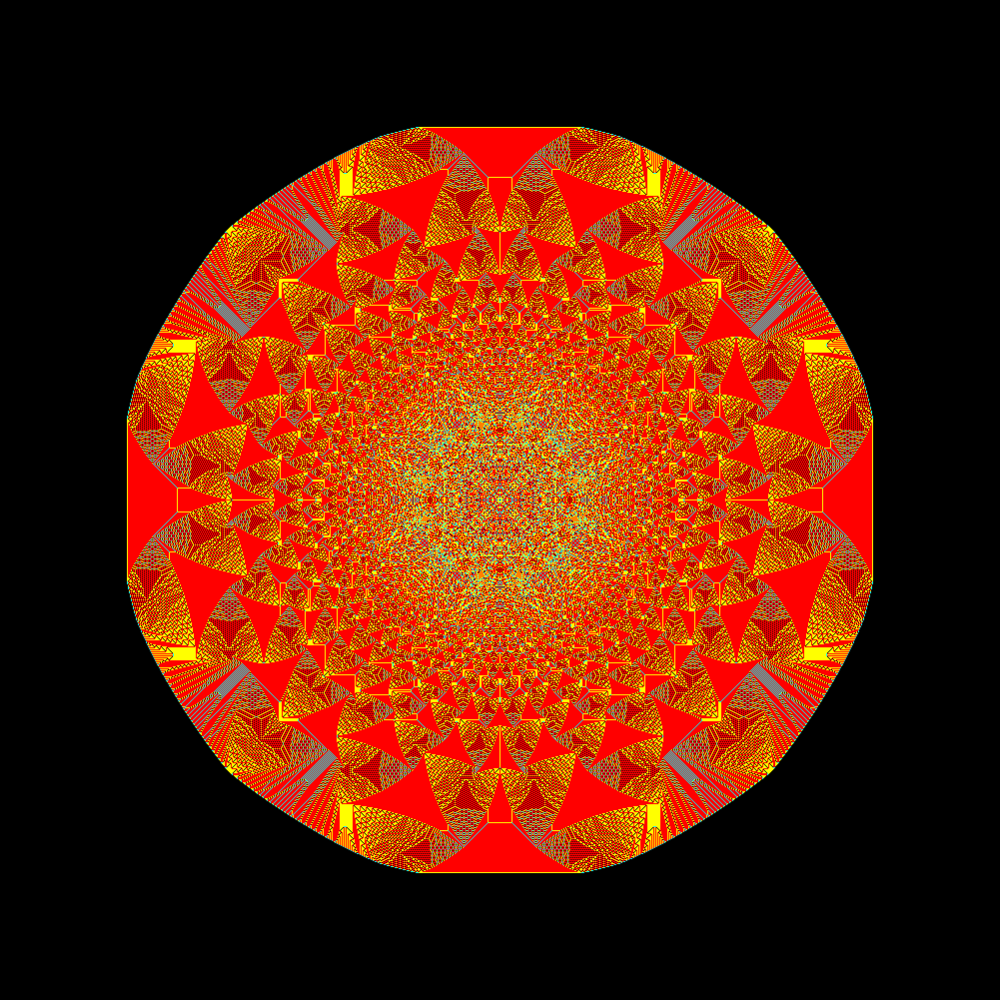
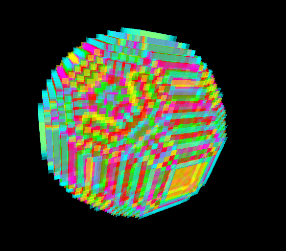
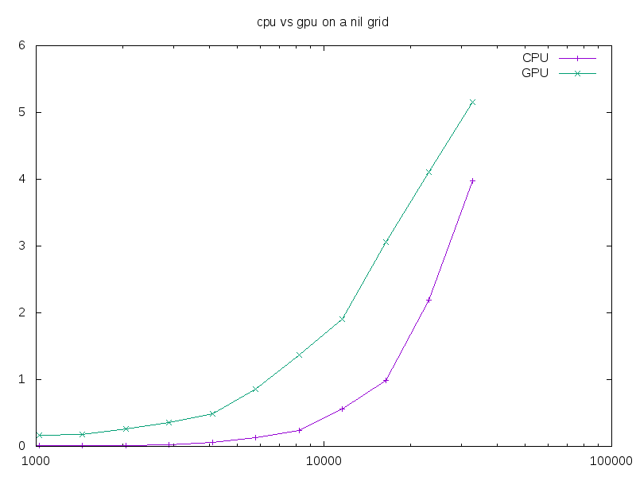

[Abelian sandpile model](https://en.wikipedia.org/wiki/Abelian_sandpile_model)

Seen on [numberphile](https://www.youtube.com/watch?v=1MtEUErz7Gg)

[Launch](https://thenumbernine.github.io/glapp/index.html?dir=/Topple&file=topple-glsl.lua) this repo's Lua version live, emulated WebGL demo.

You can also see my [JavaScript version](https://github.com/thenumbernine/topple-js) which contains a native WebGL demo.

CPU version flags and updates only dirty cells.

GPU version processes all at once.

